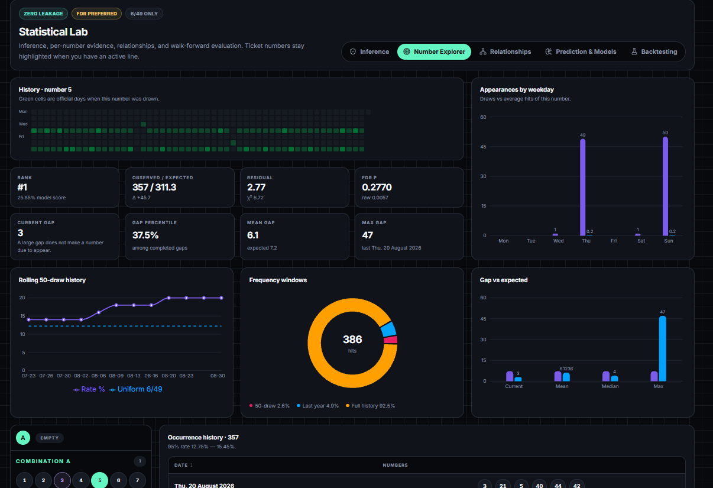
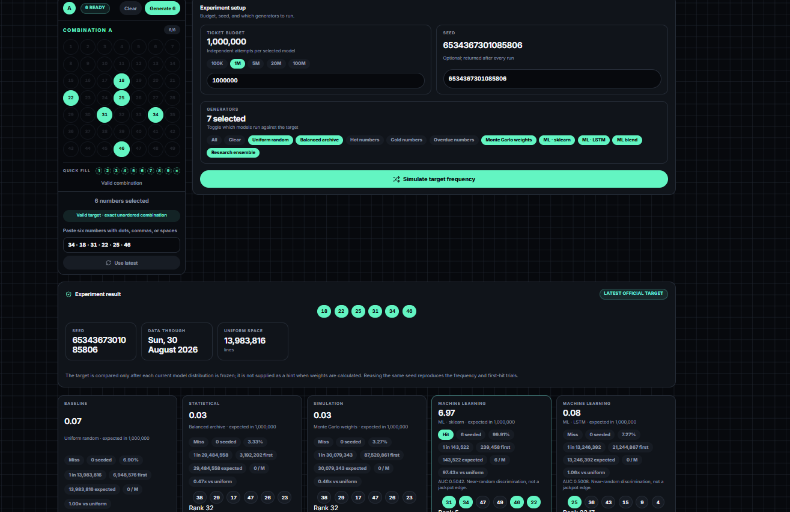

# loto-gpt

`loto-gpt` is a local Romanian-lottery research application for browsing historical draws, inspecting number behavior, generating experimental ticket lines, training models, and evaluating Loto 6/49 rankings.

It combines a React/Vite interface, a CSV-backed FastAPI service, a legacy multi-game generator/ML/RAG layer, and a stricter Loto 6/49 research pipeline with temporal features, multiple-testing correction, null simulation, immutable predictions, walk-forward evaluation, and a Champion/Challenger registry.

> **Research disclaimer:** every valid lottery combination remains possible. “Hot”, “cold”, “overdue”, ML, RAG, confidence, and Monte Carlo scores describe software behavior or historical data; none guarantees an advantage in the physical lottery. A long absence does not make a number due.

## Current repository state

Snapshot inspected on **31 August 2026**:

| Item | Committed value |
|---|---:|
| CSV rows / columns | 9,368 / 141 |
| Loto 6/49 raw rows | 2,543 |
| Loto 6/49 validated unique identities | 2,542 |
| Noroc / Loto 5/40 / Joker rows | 2,284 / 2,414 / 2,127 |
| Archive range | 7 February 1993 – 30 August 2026 |
| Registered 6/49 research candidates | 8 rejected, 0 production |
| Latest statistical verdict | insufficient evidence against uniformity (`p = 0.43281644`) |
| Latest saved prediction | 3 September 2026; Top 6 `5, 18, 19, 3, 36, 25`; confidence `low` |

The raw/validated 6/49 difference is one exact duplicate for `2018-11-29` (`3, 4, 9, 12, 18, 27`). Runtime loading removes exact identities while preserving distinct special draws held on the same date.

The latest statistical report covers 2,542 validated draws through 30 August 2026 and 400 seeded null simulations. The latest stored walk-forward report is older: 180 targets from 27 October 2024 through 6 August 2026. Compare a report’s `dataset_version` with the current dataset hash before treating it as current.

## Product map

- **Dashboard** — latest result, archive activity, research verdict, next check, current experimental Top 6, and ticket activity.
- **Generator** — manual/system tickets and Balanced, Hot, Cold, Overdue, Monte Carlo, legacy sklearn, and legacy LSTM generation. Analyze scans all historical draws and can attach ML/RAG context.
- **Lab / Inference** — uniformity, adjusted number signals, drift, entropy, gaps, autocorrelation, draw patterns, and null simulation.
- **Lab / Number explorer** — all 49 numbers with observed/expected counts, residuals, intervals, rolling windows, gaps, trends, period behavior, prediction rank, and model factors.
- **Lab / Relationships** — all 1,176 pairs with expected counts, lift, recency, residuals, and raw/FDR-adjusted p-values.
- **Lab / Prediction** — immutable 49-number ranking, component weights, uncertainty, explanations, and recommended sets.
- **Lab / Backtest** — expanding-window strategies, ablations, frozen logistic model, year stability, calibration, and random-strategy comparisons.
- **Archive** — paginated CSV history, raw source cells, prize/category data, and source URLs.
- **Target simulator** — exact first-hit/count experiment for one fixed six-number set under uniform, archive, ML, and research-ensemble weights.

The target simulator measures the configured **ticket generator**, not the physical draw. The target never changes model weights.

## Application examples

### Example 1


### Example 2



### Example 3



## Architecture

```text
Official loto.ro result page
  → validate date + six unique numbers in 1..49
  → evaluate any existing pre-draw immutable snapshot
  → atomic CSV append + provenance sidecar
  → rebuild statistics
  → train/reject/promote Challenger when enabled
  → freeze next prediction
  → refresh legacy caches
  → FastAPI → Vite proxy → React UI
```

Two analytical layers coexist:

| Layer | Scope | Purpose | Status |
|---|---|---|---|
| Legacy | 6/49, 5/40, Joker, Noroc | UI generation, line analysis, Gradient Boosting, LSTM, vector retrieval | archived/non-promotion-eligible |
| Research | Loto 6/49 only | inference, leakage-safe features, immutable prediction, temporal evaluation, registry | promotion-gated; no current Champion |

A legacy line `score` is not a calibrated probability, and a Lab null simulation is not ticket generation.

## Games as implemented

| Key | Label | Main pool | Pick used by code | Extra | Support |
|---|---|---:|---:|---:|---|
| `6din49` | Loto 6/49 | 49 | 6 | optional seven-digit Noroc | research + legacy |
| `5din40` | Loto 5/40 | 40 | **6** | none | legacy |
| `joker` | Joker | 45 | 5 | 1–20 Joker | legacy |
| `noroc` | Noroc | digits 0–9 | seven positions | none | data/API |

`5din40` currently uses `pick: 6` in frontend and backend despite its label. This documents the code as it exists; verify/correct it before treating it as official game logic.

## History and persistence

`data/lottery/lottery_history.csv` is the runtime source of truth. Its fields cover:

- identity: row/game labels and draw index;
- normalized/raw date, year, quarter, month, weekday, ISO week;
- result JSON, original/sorted CSV, numbered columns, Joker/Noroc values;
- sum, min/max/span, odd/even, low/high, uniqueness, consecutive pairs;
- prize winners/values/reports and category JSON;
- raw cells, source URL, and `rag_text`.

`loto649_draw_metadata.jsonl` adds official ID, source hash, and fetch time for incremental 6/49 draws. The strict domain accepts only six distinct values in `1..49`, preserves distinct same-day draws, and rejects official-ID conflicts.

### Archive rebuild

```bash
python lottery_scraper.py archive \
  --base-url https://your-source-site/ \
  --start-year 1993 --end-year 2026 \
  --output data/lottery --delay 0.3
python scripts/build_history_csv.py
```

The scraper normalizes Romanian dates, table cells, categories, prizes, and results. The builder creates and sorts the standalone 141-column CSV. Review/back up generated data before replacement.

### Official 6/49 update order

The dedicated adapter reads `.rezultate-extrageri-content`, extracts “6 / 49 din DD.MM.YYYY”, and reads ball numbers from `/bile/<number>.png` paths.

1. Read the last validated date and fetch missing year/month pages with retry/backoff.
2. Validate dates and values.
3. Evaluate a matching immutable prediction **before** inserting its result.
4. Atomically append under a file lock and atomically rewrite provenance.
5. Reload caches and rebuild the versioned statistical report.
6. Optionally train a Challenger; failure never rolls back a valid result.
7. Freeze a prediction for the next configured Thursday/Sunday draw.

`result_not_published` and `already_up_to_date` are successful no-ops. A network/parser failure returns `source_error`, writes no empty draw, and makes the CLI exit 2.

The GitHub workflow checks at 17:30, 19:30, and 21:30 UTC on Thursdays/Sundays. Runs are idempotent and commit only changed data/artifacts.

## Statistical logic

For a uniform Loto 6/49 draw:

```text
number probability p1 = 6 / 49
pair probability p2   = C(47,4) / C(49,6) = (6×5)/(49×48)
triple probability p3 = C(46,3) / C(49,6) = (6×5×4)/(49×48×47)
combination space     = C(49,6) = 13,983,816
```

### Frequency and uniformity

For `N` validated draws and number `i`:

```text
expected E             = N × p1
binomial variance V    = N × p1 × (1-p1)
standardized residual  = (observed_i - E) / sqrt(V)
chi contribution_i     = (observed_i - E)^2 / E
global chi-square      = sum(chi contribution_i), df = 48
```

Each number gets a 95% Wilson interval. Two-sided normal p-values are Benjamini–Hochberg (BH) adjusted across all 49 tests; the UI should prefer `adjusted_p_value`.

Signal labels are `statistically_interesting` (adjusted p below alpha and stability at least 0.6), `unstable` (significant but unstable), `watch` (raw p below alpha or `|z| >= 2`), `weak_signal` (`|z| >= 1.25`), or `neutral`. Both default alpha values are `0.05`.

### Rolling frequency, gaps, and trends

Rates are calculated over the last 10/25/50/100/250/500 draws, last 1/3/5 years, and full history.

```text
current gap            = draws since last appearance
completed gap          = intervening draws between appearances
uniform gap tail       = (1 - 6/49)^current_gap
expected failed draws  = (1-p1)/p1 = 43/6 ≈ 7.1667
trend delta            = recent-50 rate - full rate
drift score            = |trend delta| / p1
EWMA alpha             = 2/(span+1), default span 25
```

Gap-tail values are BH-adjusted across 49 numbers. They are censored descriptive evidence, never a “due number” rule.

### Relationships, drift, and draw shape

- All `C(49,2) = 1,176` pairs use expected `N×p2`, binomial residuals, two-sided p-values, BH correction, lift, recency, average gap, and exact-binomial marginal percentile.
- Triples use expected `N×p3`. Support must be at least 4, but BH uses all `C(49,3) = 18,424` hypotheses; reports retain at most 500 rows.
- Drift compares `1993–2000`, `2001–2010`, `2011–2020`, and `2021–present` with Jensen–Shannon divergence, Population Stability Index, and a period/number chi-square test.
- Custom period comparisons perform 49 two-proportion z-tests followed by BH.
- Autocorrelation tests every number’s binary series at lags 1–5 (245 adjusted hypotheses).
- Marginal/pair Shannon entropy is normalized by `log2(49)` / `log2(C(49,2))`.
- Draw profiles report sum, spread, odd count, low (`1..24`) count, and consecutive pairs. Odd/low distributions use hypergeometric expectations.
- The theoretical sum mean is `6×(49+1)/2 = 150`; its mean z-test uses finite-population variance.

### Uniform-without-replacement null simulation

The Lab simulates complete archives using six distinct uniformly sampled values per draw. It compares real versus null global chi-square, maximum number/pair residual, maximum current gap, and normalized marginal entropy. Empirical p-values use `(exceedances+1)/(runs+1)`. Default runs: 400; hard maximum: 10,000.

This tests archive anomalies. It is separate from the ticket-generating Monte Carlo strategy.

## Temporal features

The research builder emits 49 rows per target. Every frame uses strictly earlier draws and audits `history_end_date < target_date`; same-date special draws are skipped as ML targets because publication order is unknown.

The 25 `649-features-v2` inputs are:

| Group | Features | Meaning |
|---|---|---|
| Identity | `number_norm` | number / 49 |
| Frequency | `freq_full`, `freq_10/25/50/100/250/500` | prior-only appearance rates |
| Gap | `gap_current`, `gap_norm`, `gap_mean`, `gap_percentile` | current/typical absence |
| Heat/trend | `hot_score`, `cold_score`, `trend_score`, `ewma_frequency` | normalized heat, inverse, recent/full trend, EWMA |
| Pairs | `pair_strength`, `pair_recent_strength` | average lift with previous-draw numbers, full and last 100 |
| Inference | `chi_contribution_history`, `drift_score` | historical residual contribution and trend magnitude |
| Global context | `draw_count_history`, `rolling_entropy`, `frequency_dispersion`, `pair_dispersion`, `recent_vs_long_term_divergence` | dataset state |

Min-max normalization returns `0.5` for a constant family.

## Research prediction and models

### Built-in baselines

Each strategy emits 49 `[0,1]` ranking scores and marginals calibrated to sum to six.

```text
statistics = .25 full frequency + .30 recent-50 + .20 trend
           + .15 recent pair strength + .10 EWMA

balanced   = .30 recent-50 + .22 full frequency + .18 gap percentile
           + .16 recent pair strength + .14 trend

monte_carlo = balanced + seeded Normal(0, .015) ranking noise
```

Backtests also include uniform, frequency-only, recent frequency, hot, cold, overdue, and staged ablations. Calibration rescales positive weights to sum to six, caps marginals at `0.999`, and water-fills overflow. These marginals do not claim independence.

### Promotion-controlled sklearn ranker

The research model is `StandardScaler` → `LogisticRegression(C=.35, solver=lbfgs, max_iter=600, random_state=42)`. Its unit is one number for one future draw.

Training uses up to the latest 700 targets after at least 100 history draws. The latest 120 target dates are chronological validation: first half for ensemble tuning, second half untouched final validation. A 0.1 simplex searches sklearn/statistics/Monte Carlo weights with at least 20% sklearn, maximizing NDCG@10 then minimizing Brier score. Only a passing topology is refit through all available temporal rows.

Promotion requires every gate:

| Gate | Threshold |
|---|---:|
| NDCG@10 improvement over stronger statistics/Champion reference | `>= 0.002` |
| Brier degradation versus better reference | `<= 0.002` |
| random-strategy empirical p for mean hits@6 | `<= 0.05` |
| worst early/late NDCG@10 regression | `>= -0.02` |
| leakage audit | pass |

Promotion archives the former Champion; rejection keeps the artifact/audit. Currently all eight candidates are rejected, so snapshots use built-ins only. The latest snapshot renormalized configured `statistics=.30` and `monte_carlo=.15` to `2/3` and `1/3`; confidence is low because fewer than three families are available.

### Optional PyTorch experiment

When enabled and installed:

```text
49×25 inputs → Dense(128) → ReLU → Dropout(.2)
             → Dense(64) → ReLU → Dense(49)
BCEWithLogitsLoss; Adam(lr=.001, weight_decay=1e-4); 40 epochs; 80/20 temporal split
```

It remains rejected until it passes the common frozen-range protocol. PyTorch is disabled and absent from default requirements.

## Legacy ML and local RAG

These power generator/API options but are archived by the strict audit.

### Gradient Boosting

Features are full and 5/15/50-draw frequencies, gap, normalized gap, previous-draw pair co-occurrence, month/weekday, number identity, oddness, and decade. The model is `GradientBoostingClassifier(n_estimators=120, learning_rate=.08, max_depth=4, random_state=42)` with an 80/20 temporal split and ROC AUC. Missing models train during requests only with `ALLOW_RUNTIME_TRAINING=1`.

### LSTM

```text
previous lookback multi-hot draws → LSTM(128, sequences=True) → Dropout(.2)
                                  → LSTM(64) → Dropout(.2)
                                  → Dense(pool, sigmoid)
Adam(.001); binary cross-entropy; chronological 80/20 split
```

Lookbacks: 10, 15, 25, 50, 100. Seed, dataset hash, cutoff, and chart are saved, but the artifact lacks common walk-forward promotion evidence. When both legacy models exist, `blend = .42 sklearn + .58 LSTM`.

### Vector retrieval

Each draw becomes a pool-sized multi-hot vector plus normalized sum, span, odd ratio, and decade coverage, then is L2-normalized. Cosine similarity is a matrix dot product. Queries use a selected line or the normalized mean of the latest five embeddings. Similar-draw numbers accumulate similarity weights and are max-normalized.

Optional legacy API blend: `probability_final = .35 RAG + .65 legacy ML`. This is NumPy nearest-neighbor retrieval, not a vector database or language model.

## Ticket generation and calculations

### Archive weights

```text
hot     = (count+1)/(maximum count+1)
cold    = (maximum count+1-count)/(maximum count+1)
overdue = (current gap+1)/(maximum current gap+1)

balanced    = .44 hot + .38 overdue + .18 cold
MC seed mix = .42 hot + .38 overdue + .20 cold
```

Numbers are weighted-sampled without replacement; duplicate lines are discarded.

### Legacy heuristic scores

```text
line score = 100 × (
  .36 average normalized frequency + .28 average normalized gap
  + .14 span/pool + .12 odd/even balance + .10 top-pair strength)

number score = 100 × (
  .50 all-time frequency + .25 last-50 frequency + .25 current-gap score)
```

Only the 20 most frequent archive pairs contribute to line pair strength. These are UI heuristics, not probabilities or expected return.

### MC ticket generator

Archive-weighted candidates are heuristic-ranked, shortlisted, and bootstrapped against historical draws 150–500 times each. Hit weights are `0→0`, `1→.05`, `2→.35`, `3→1`, `4→3`, `5→6`, `6→10`; a Joker hit adds `2.5`.

```text
final MC score = .55 × expected_match_score × 10 + .45 × line score
```

### Exact target simulator

Uniform exact-set probability is `1/C(49,6) = 1/13,983,816`. For weighted sampling, a 64-state dynamic program sums all `6!` target orderings while reducing the remaining total weight after every pick.

```text
expected attempts        = 1/p
q-attempt quantile       = ceil(log(1-q)/log(1-p))
chance within L attempts = 1-(1-p)^L
expected hits in L       = L×p
```

A seeded geometric draw produces first hit; a seeded binomial draw produces additional hits. This is statistically equivalent to individual attempts without looping up to `10^12` times.

### Prices implemented by the UI

```text
6/49 system lines  = C(selected,6)
6/49 variant cost  = lines × 8 RON
form fee           = .50 RON per slip with a completed variant
Noroc              = count × 5 RON

Joker main lines   = C(main_count,5)
Joker total lines  = main lines × joker_count
Joker cost         = total lines × 5 RON
```

A 6/49 slip has variants A/B/C. Noroc requires a completed variant and supports up to 64,000 consecutive codes. Prices are hard-coded simulator values; verify current official prices.

## Predictions and evaluation

A research snapshot includes a deterministic ID (target date + history hash + versions + seed + config fingerprint), all 49 calibrated marginals/ranks, Top 6/10/15, up to eight weighted/diversified sets, active weights/versions, component disagreement, per-number confidence, factor text, and logistic contributions when a Champion exists.

Prediction files are immutable; the same identity must be byte-identical. Evaluation is a separate immutable file created only after fetching the official target result and only when `prediction.created_at < draw.fetched_at`. Confidence means model agreement, not chance of winning.

Metrics: hits/precision/recall at 6 and 10, mean reciprocal rank, NDCG@6/@10, ranks of winners, 49-outcome Brier score, clipped binary log loss, ten-bin expected calibration error/curve, and 0–6 hit distribution.

### Walk-forward protocol

Default: at least 250 prior draws, last 180 eligible targets. Each feature frame expands through the prior draw only. One logistic model is fitted before the frozen test range; its model weights are not updated inside that range.

Every strategy is compared with 1,000 seeded random-ticket strategies using mean hits@6, random 95% interval, percentile, empirical p-value, effect size, and yearly aggregation.

## Repository layout

```text
config/loto649.json                       central research configuration
data/lottery/lottery_history.csv          canonical archive
data/lottery/loto649_draw_metadata.jsonl  official provenance
data/lottery/ml_models/                   legacy/research artifacts
data/lottery/ml_charts/                   legacy training charts
data/lottery/vectors/                     local NumPy indexes
data/lottery/model_registry/loto649/       registry + event log
data/lottery/reports/loto649/              stats/predictions/evaluations/backtests/logs
backend/loto649/                           strict 6/49 pipeline
backend/server.py                          full FastAPI + legacy layer
backend/wsgi.py                            optional reduced WSGI API
backend/ml_engine.py                       legacy sklearn/LSTM
backend/vector_store.py                    cosine retrieval
backend/target_simulation.py               exact target experiment
scripts/loto649_pipeline.py                research CLI
src/                                      React UI
tests/                                    backend tests
```

## Setup and run

Use **Python 3.12** and Node.js 22. The repository supports Windows and Linux/macOS; npm scripts use the active environment's `python` command.

Windows PowerShell:

```powershell
uv venv --python 3.12 .venv
.\.venv\Scripts\Activate.ps1
python -m pip install --upgrade pip
pip install -r backend/requirements.txt
npm ci
npm run dev
```

Windows Git Bash uses `source .venv/Scripts/activate`. Linux/macOS uses:

```bash
python3.12 -m venv .venv
source .venv/bin/activate
python -m pip install --upgrade pip
pip install -r backend/requirements.txt
npm ci
npm run dev
```

- UI: `http://localhost:5173`
- FastAPI/OpenAPI: `http://127.0.0.1:8030/docs`
- Vite proxies `/api` to port 8030.

Separate processes: `npm run dev:api` and `npm run dev:web`. Frontend build: `npm run build`; preview: `npm run preview`.

Pipeline-only automation may install `backend/requirements-pipeline.txt` instead of TensorFlow-heavy full requirements.

### Docker

`docker compose up --build` builds the UI and full FastAPI/Uvicorn service on `http://localhost:8030`. The lottery data directory is bind-mounted for persistence.

## Pipeline and training commands

```bash
python scripts/loto649_pipeline.py update [--dry-run] [--no-train]
python scripts/loto649_pipeline.py statistics [--simulations 400] [--seed 42]
python scripts/loto649_pipeline.py predict [--target-date YYYY-MM-DD] [--ephemeral]
python scripts/loto649_pipeline.py backtest [--draws 180] [--random-strategies 1000] [--seed 42]
python scripts/loto649_pipeline.py backtest --cached
python scripts/loto649_pipeline.py train
python scripts/loto649_pipeline.py models
```

Shortcuts: `npm run loto649:update`, `npm run loto649:stats`, `npm run loto649:backtest`, and `npm run loto649:train`.

Legacy LSTM training:

```bash
python backend/train_lstm.py --game 6din49 --epochs 30 --lookback 25 --seed 649
python backend/train_lstm.py --all
```

`--all` skips games with fewer than `lookback+11` draws. These are legacy artifacts, not automatic research Champions.

## API surfaces

### Full FastAPI development API

| Routes | Purpose |
|---|---|
| `GET /api/health`, `/summary`, `/dataset` | status and data inventory |
| `GET /api/history`, `/export/csv`, `/draws` | flat export and paginated history |
| `GET /api/stats`, `/number-analysis` | legacy game/number statistics |
| `GET /api/ml`, `GET/POST /api/ml/predict` | legacy model report/prediction |
| `GET/POST /api/rag/similar`, `GET /api/rag/search` | vector and text retrieval |
| `POST /api/generate`, `/analyze`, `/calculate` | tickets and historical analysis |
| `POST /api/649/target-simulation` | exact target experiment |
| `GET /api/649/latest`, `/history` | strict validated 6/49 history |
| `GET /api/649/statistics` | compact; `compact=false` returns full report |
| `GET /api/649/statistics/numbers[/{number}]` | 49-number explorer/detail |
| `GET /api/649/statistics/pairs`, `/tests`, `/compare` | relationships/inference |
| `GET /api/649/prediction/latest`, `/predictions/history` | snapshots/evaluations |
| `GET /api/649/models`, `/backtest` | registry and cached backtest |
| `POST /api/649/update`, `/train`, `/backtest` | protected jobs |

Example bodies:

```json
{"game":"6din49","strategy":"balanced","ticket_count":6,"seed":42,"simulations":2500}
```

```json
{"game":"6din49","numbers":[1,2,3,4,5,6],"simulations":900,"include_ml":true}
```

```json
{"numbers":[1,2,3,4,5,6],"attempt_limit":1000000,"models":["random","balanced","research_ensemble"],"seed":42}
```

### Admin, production, and optional WSGI API

Set `LOTO649_ADMIN_TOKEN` and send it as `X-Admin-Token` to the protected update/train/backtest POST routes. `LOTO649_ALLOW_UNAUTHENTICATED_ADMIN=1` is a controlled-local-only bypass.

`backend/production.py` runs the full `server:app` FastAPI application with Uvicorn and is the Docker entrypoint. The separate `backend/wsgi.py` is an optional reduced surface: health, summary, stats, draws, ML report, generate, analyze, calculate, target simulation, and static paths. It omits strict statistics/predictions/models/backtests/admin, history/export, and RAG.

## Environment variables

| Variable | Default | Meaning |
|---|---:|---|
| `LOTO649_ADMIN_TOKEN` | unset | FastAPI admin token |
| `LOTO649_ALLOW_UNAUTHENTICATED_ADMIN` | false | local admin bypass |
| `ALLOW_RUNTIME_TRAINING` | false | legacy request-time training |
| `HOST`, `PORT` | `0.0.0.0`, `8030` | production listen address |
| `WEB_WORKERS` | `WEB_THREADS` or `1` | Uvicorn worker processes |
| `CORS_ORIGINS` | same-origin | WSGI origins, CSV list or `*` |
| `RATE_LIMIT_DEFAULT_MAX/WINDOW` | `120/60s` | ordinary WSGI requests |
| `RATE_LIMIT_HEAVY_MAX/WINDOW` | `20/60s` | generate/analyze/calculate |
| `RATE_LIMIT_ML_MAX/WINDOW` | `5/60s` | ML/target requests |
| `MAX_BODY_BYTES` | `65536` | WSGI POST limit |
| `DEBUG` | false | expose unexpected WSGI errors |

The FastAPI application currently allows all CORS origins and does not use the WSGI limiter/security headers in either development or the Uvicorn production launcher. The related Docker environment values affect only the optional WSGI surface unless FastAPI is hardened separately.

## Tests

```bash
npm run test:backend
```

The 35 tests cover API contracts/authentication, source failures, exact probability/seeds, idempotent persistence, same-day draws, immutable snapshots/evaluations, update order/retry, statistical formulas/BH/null simulation, gap warnings, temporal leakage, model identity, ranking/calibration metrics, and walk-forward evaluation.

## Known limitations

- No production Champion; current rankings are baseline experiments.
- The latest backtest predates the current dataset and should be recomputed.
- The CSV contains one exact 6/49 duplicate, removed only at runtime.
- `5din40` is configured for six numbers; confirm intent.
- The optional WSGI surface cannot power every research endpoint/view; the Uvicorn/FastAPI entrypoint can.
- Legacy sklearn/LSTM artifacts lack strict promotion evidence.
- RAG is nearest-neighbor retrieval, not natural-language generation.
- Binary model artifacts are Python/TensorFlow-version-sensitive.

## Further notes

- [Statistical upgrade implementation](docs/STATISTICAL_UPGRADE_IMPLEMENTATION.md)
- [Upgrade specification](STATISTICAL_AND_PREDICTION_UPGRADE.md)
- [Backend notes](backend/README.md)
